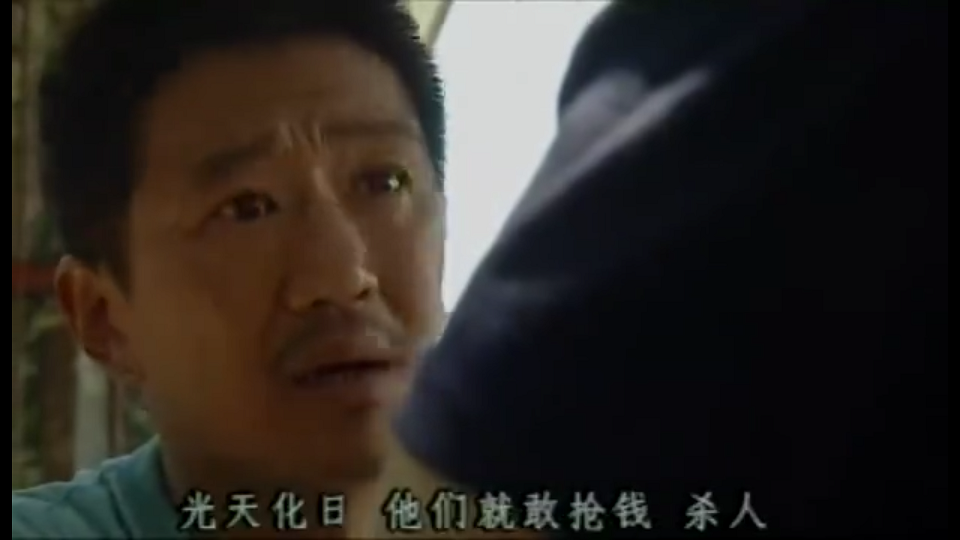

新闻.日记
=============

这个页面用来记录生活中发生的时事，评论，按照日记的格式来记录。

2018/08/07 **精致的利己主义者**
-------------------------------

这个名词是北大一个教授提出的，指的是高情商，高智商，但是一切出发点基于自我利益的考虑。

需要注意的是，这也是一个已经烂大街的词，其外延的宽泛，往往导致人们用来互相攻击。

刚看到这个词时，我想到的是芮成钢，前北大高材生，央视主持人，一个80后杰出的代表，高官政要的好朋友，中国青年中的佼佼者，亚洲人民的代表。 这样一个高光的形象，居然卷入贪腐。如果坊间传言属实的话，其所有的表演，装饰，代表都是出于自己的私利，为了私利甚至不择手段，没有下限。

仔细观察一下，身边其实很多这样的人。他们收入高，聪明，生活体面。对自己和家庭非常负责，但是对社会缺乏起码的同理心。事不关己的事往往高高挂起。对强者有着宗教般的崇拜心理，对弱者缺乏基本的同情心。

2018/08/04 **还是中美贸易战**
-----------------------------------

两年前的文章，特郎普当选后，国家发展与战略研究院研究员杨其静 曾经写过一篇文章，指出特朗普当选后中国面临的挑战。当时这篇文章没有引起重视。两年后当中美贸易战高潮迭起时，很多人回头翻出了这边文章。贸易战以来，各路牛鬼蛇神跳了出来发表高见，顺带夹带点私货。这篇文章是贸易战以来，各种分析文章里写的最中肯的一篇文章。更难能可贵的是，这篇文章不是马后炮。不能不说其当时的文章具有一定的前瞻性。

`特朗普当选，中国面临巨大挑战 <https://mp.weixin.qq.com/s/OIMjbEqqERai4nm5APqeTw>`_

2018/08/03 **兼听则明**
-----------------------------------

`高善文在山西证券30周年活动上的演讲(链接已失效) <https://xueqiu.com/2549454474/111366318>`_

2018/08/02 **中美贸易站再起波澜**
----------------------------------

中美贸易站再起波澜，今天股市大跌。

Statement By U.S. Trade Representative Robert Lighthizer on Section 301 Action

Washington, DC – U.S. Trade Representative Robert Lighthizer today released the following statement regarding further action under Section 301 of the Trade Act of 1974:

“On June 18, the President directed me to identify $200 billion worth of Chinese goods for additional tariffs at a rate of 10 percent, in response to China’s decision to cause further harm to U.S. workers, farmers, and businesses by imposing retaliatory duties on U.S. goods. I initiated this process on July 10.

“This week, the President has directed that I consider increasing the proposed level of the additional duty from 10 percent to 25 percent. The 25 percent duty would be applied to the proposed list of products previously announced on July 10.

“The Trump Administration continues to urge China to stop its unfair practices, open its market, and engage in true market competition. We have been very clear about the specific changes China should undertake. Regrettably, instead of changing its harmful behavior, China has illegally retaliated against U.S. workers, farmers, ranchers and businesses.

“The increase in the possible rate of the additional duty is intended to provide the Administration with additional options to encourage China to change its harmful policies and behavior and adopt policies that will lead to fairer markets and prosperity for all of our citizens.

“The United States has joined forces with like-minded partners around the world to address unfair trade practices such as forced technology transfer and intellectual property theft, and we remain ready to engage with China in negotiations that could resolve these and other problems detailed in our Section 301 report.”

Interested parties may address this possible increase in the level of the additional duty in their comments on the proposed action. The proposed list and process for the public notice and comment period is set out in the Federal Register notice issued on July 10 and published in the Federal Register on July 17. To view the July 17 notice, including the list of proposed products to be subject to additional duties, click here. In light of the possible increase of the additional duty rate to 25 percent, the close of the written comment period is extended from August 30 to September 5, and the due date for requests to appear at the public hearing is extended to August 13. These modifications to the comment period will be set out in a notice to be published shortly in the Federal Register.

2018/07/29 **汤案**
-----------------------

多少年以后，汤案会不会有另外的真相呢？至少从目前来看，从法律角度讲，这个案件的证据是漏洞和缺失的。案件除了当事人口供，并没有完整的证据链条。

不过，疫苗案的热度已经消退。长生生物的高管一窝端，全部刑拘。监管部门目前无人负责。

2018/07/27 **性侵**
-------------------

最近，很多人在网上爆料自己遭到知名人士的性侵，包括 章文，孙冕，朱军，雷闯...

大概半年前吧，北航的一位毕业生在网上爆料自己在北航上学期间遭到导师的性侵。

这是社会的一种进步，女性在遭到不公平待遇后可以大胆的说出来，至少说明公众现在现在对女性“失身”宽容很多。

性侵就是性侵，是一种犯罪行为。跟我是不是荡妇没有关系，我是荡妇不意味着你就可以侵犯我。

这也是一种警示和震慑，还是那句话，“出来混，迟早要还的”。

举报朱军的帖子已经被删的干干净净。看来为党干活的人，关键时候党会保你的。

举报章文的女生已经携设证据报警，章文这次估计要进去了。

2018/07/25 **出来混，迟早要还的**
------------------------------------

疫苗事件继续发酵，董事长及高管被刑拘。有人扒出长生生物当年私有化时，涉嫌巧取豪夺优质国有资产。纪委也表态，要追查当年私有化过程。这个是很多企业家的原罪，产生于特殊背景下。过了这么多年，大部分情况是你好我好大家好。一旦出事，就是泥沙俱下，成为罪证。这个罪名可重可轻，就看你是否配合，上面是否有人替你说话了。

长生生物的只有27名销售人员，但是营销费用却达到了5亿每年。 这其中有多少猫腻，用屁股都能想的到。 
国家这次表态要严查，让吃瓜群众非常期待。 但是是真查，还是走过场给全国人民一个交代，就看有没有追查这5亿的营销费用去向。 目前就山东在表态，要追查长生疫苗进入山东市场是否涉及权钱交易和行贿受贿。其他省份暂时没有表态。 但这5亿的营销费用绝对不会用在山东一个省份。就看其他省份会不会跟进了。

追查这5个亿的营销费用，会对药品监管领域的官员产生一种震慑。在药品食品领域，不允许也不能有权钱交易，收钱办事。否则严格监管，食品药品安全就是一句空话。希望籍此消灭医疗领域这么多年灰色地带，让药品食品更加安全。

如果最后还是处罚了长生，撤职几个领导，5亿营销费用的去向没有交代。那这个链条上所有人还在医疗监管领域，那这个事件基本上止于此。除了几个倒霉蛋，其他人该干什么还是干什么。就像当年因为三聚氰胺被处分的官员，现在在监管药品。

.. _yimiaoshijian:

2018/07/24 **疫苗事件**
---------------------------

最近疫苗造价事件愈演愈烈，老大老二都发声要指示严办。这次长生生物算个撞在枪口上了，结局会很惨。

但是这件事情很奇怪，这次造假并没有引起严重的后果，至少不像几年前乙肝疫苗致死案，但是舆论发酵的程度远远超出那次。而那次十几个小孩注射疫苗后非正常死亡，媒体报道，官方介入后，调查结论是跟疫苗没有关系，最终不了了之。

这次舆情发展到现在，我觉得有个很重要的原因是，疫苗产业欠的历史帐该还了。康泰造的孽，长生生物要一起还了。

对大部分来说，合格的疫苗是非常有用且安全的。但是很小比例的受众会导致不良反应并引发严重后果。很小的比例乘以巨大的基数，会导致一些个案的发生。个案虽少，但是每一个个案后面都是一个家庭的人伦惨剧。我们的政府和企业面对这种个案的处理，过去采取的都是甩锅的态度。每次事故，调查的结论无一例外都是疫苗是安全的，悲剧是因为偶合症导致的，说的直白点就是你个体体质问题，自认倒霉吧，跟我们没有关系。结果现在爆出疫苗生产不合规定，甚至造假，那群众当然不答应了。生产造假，赚钱赚的手软，出事了就甩锅，党都看不下去了。

另外值得一提的是，这次官媒的反应，基本上也是一棍子打死，不留余地。 跟之前其他事件中，呼吁老百姓要理智，要客观的论调基本上看不见了。
有部分官方微博账号甚至在药监局官微下面爆粗。背后政治上的考量不清楚，但是情感上是可以理解的。奶粉可以吃进口的，但是疫苗大部分都是国产的。所以疫苗造假，带来的是无差别的伤害。

2018/07/19 **一锤定音，定于一尊**
-----------------------------------

	有句话叫做，“始作俑者，其无后乎”

    .. image:: ../_static/2018_07_19_yituidingyin.png

2018/07/18  **自制力**
------------------------
    
    煎熬的几天。

2018/07/17 **摇号**
-------------------

    今天开始申请新能源指标。

2018/07/16 **《我不是药神》**
------------------------------

	法国4:2战胜克罗地亚，夺取2018年俄罗斯世界杯冠军。 20年后再次登顶世界之巅。

	周末观看徐峥的电影《我不是药神》。 确实是一部非常不错的电影，题材很有现实意义，拍的也接地气。 

	很多人觉得这种题材能够过审很意外。我看完后觉得还好，没有对审片底线的突破。 特别是结局，虽然主人公最终入狱，但结局也算是比较圆满。 主人公也获得了轻判，药品也最终进了医保。 

	抗癌药药品为什么这么贵，药厂背了锅，影片要是再稍微深入挖一下就完美了。

	这是一部考验智商加价值观的影片。 药品这么贵的锅都被制药厂背锅了。电影中卖假药的骗子在道德上都碾压了制药厂的“买办”。

	那首要的问题是，药是从哪来的？ 药不是地下的煤或者矿床里面的金子，药是药厂研究出来的。一种药品面试需要高昂的投入，如果没有高昂的利润，没有企业愿意从事这种高风险的研究。 所以药厂的高额利润无论是法律上，还是道德上都是站的住脚的。 没有利润支撑，新药的研发也就是无源之水了。

	看完这个电影抨击药厂高价的人，基本上可以划为乌合之众。

	第二个问题是，高昂的药价老百姓吃不起怎么办？ 药跟其他贵重的的消费品不一样，药是救命的必需品。他不是钻石，买不起可以不带。不是房子，买不起大的可以买小的，买不起小的可以租。 那看不起病的穷人怎么办？ 这个问题有点敏感，但是现实情况就是吃不起药的人只能等死。好多人生病了，但是迫于生计都是硬抗着，最终不治。对很多人来说，4万的药跟3千的药没有区别，没有医保的话都是吃不起。

	电影虽然没有反思药价高昂的后面原因，但是反映出高昂药价下，白血病病人对生命的渴望，和因病致穷后悲惨的生活。对此无动于衷，抨击导演的人，要么是有利益牵涉其中，要么就是良心大大的坏了。

	这是一个价值观的问题，就是穷人的命到底值不值钱。该不该花很大社会资源去救助。很多政策的背后，都是这个命题的一个博弈。

	影片的最后，提到从2018年起，进口抗癌药开始零关税。其实这个早该实行的政策了。 救命药就不应该征收关税。 政府应该出面直接跟药厂谈判，免去很多中间代理环节。 我们可以以中国的庞大市场为地气跟美帝打贸易战，为什么不能跟药厂谈判呢？ 50%的利润，让1%的人吃得起，和%1的利润，让%50的病人吃得起，对药厂来说区别不大。 药除去研发费用，本身成本并不高。当然这只是自己个人看法。

2018/07/12 **中兴解禁**
-----------------------
	
	法国1:0淘汰比利时。

	克罗地亚2:1淘汰英格兰

	克罗地亚淘汰英格兰爆出了小冷门。昨天打车碰到出租车司机买的两场是英格兰2:1胜克罗地亚和克罗地亚1:0胜英格兰。比较佩服赌球的组织者，给出的盘口需要各种计算才能保证自己稳赚不赔。

	美国准备对中国输美2000亿美元产品征收10%的关税。中方表示愤慨和抗议。商务部发言人表示要采取反制措施，但是未提及具体措施内容。语气上跟以前一样强硬，但是内容上未提及具体行动内容。这个跟以前相比有了很大的变化。

	美国商务部确认，针对中兴的禁令正式解禁。中兴通讯今天开盘涨停。

	刘震云和冯小刚开始回应崔永元的抨击。

2018/07/07 **七七卢沟桥事变**
-----------------------------

	加班中，准备QGP report，真是无聊的工作，感觉就像在沙地上盖房子，一会这里倾斜了，一会哪里倒塌了。

	今天是七七卢沟桥事变，纪念一下。今天的中国已经不是当年的中国了。我们勤奋，我们努力，我们吃苦耐劳，我们为了美好生活在奋斗，换来了一个强大的国家。

	但同时，

	中国人还是当年的中国人。 跟81年一样那些蘸着人血馒头看杀头的人一样，我们自私，我们冷漠，我们缺乏团结。我们各扫门前雪，只要不涉及自己利益，我们可以占据道德制高点肆意指责他人。一旦涉及自己的利益，我们又会肆意践踏道德的底线。

2017/07/06 **关税生效**
-----------------------

	中美双方贸易战正式开始，双方针对对方的关税措施自北京时间中午十二点开始生效。

	股市再创新低，盘中跌破2700点。 持仓浮盈已经消耗殆尽，开始进入亏损。 投资中还是不知道止盈止损的时机，或许也不应该知道。 操作策略还是持仓继续观望，要忍受一定程度的亏损。

	比利时2:1淘汰巴西，其实不算冷门。我不是真球迷，我感觉今年比利时会夺冠。

2018/07/03 **纳吉布被捕**
-------------------------

	比利时3：2逆转淘汰日本。双方实力确实有差距，但是日本人也是吓比利时人一身冷汗。

	巴西2：0淘汰墨西哥，进入8强。

	印尼总理纳吉布刚下台就被逮捕，在办公室搜出大量现金及礼物。

2018/07/02 **西班牙出局**
-------------------------

	俄罗斯世界杯，东道主俄罗斯点球大战淘汰西班牙。目前的传统强国还剩巴西，法国和英格兰。

2018/07/01 **阿根廷出局**
-------------------------

	法国4:3淘汰阿根廷，晋级8强。法国队19岁新星姆巴佩，两进球，一次造点，吸引了世界的目光。梅西再次折戟世界杯。

	葡萄牙1:2不敌乌拉圭，姆巴佩队友卡瓦独中两元。C罗和梅西双子星提前告别世界杯。

	`31岁的梅西就站在那里，看着姆巴佩像一匹脱缰的野马，眼里满是自己19岁的样子。梅西的世界杯结束了，同时也告诉我们，没有人能永远保持年轻。如果有谁能够的话\...`
	
	`只有党，建党97年来，风雨兼程，历经坎坷沧桑，穿越雪与火的历史烟云，饱受风雨洗礼，方成今日辉煌。`

	-- 来自雪球

2018/06/29 **再次发生袭击学生事件**
-----------------------------------

	RUSSIA世界杯日本0:1不敌波兰队，在跟塞维利亚同积4分，相同的胜负关系，相同净胜球，相同进球数的前提下，因为黄牌数少而晋级16强。

	上海发生袭击小学生事件，一男子持刀刺伤三名小孩，一名家长，其中两小孩送医不治。 当了家长后每次看到这种新闻都特别难受。 两个鲜活的生命，两个家庭的心头肉

	我想说，对社会不满，为什么不去帮帮中纪委反贪呢。

2018/06/28 **卫冕冠军出局**
---------------------------

	韩国2:0淘汰卫冕冠军德国队。

	韩国人可以吹一辈子牛逼，我们曾经淘汰过卫冕冠军。

	德国人打假球的嫌疑很大。

2018/06/26 **阿根廷奇迹般小组出线**
-----------------------------------

	阿根廷奇迹般出线。梅西终于进球。

	媒体就是这样，当你不进球时，各种质疑谩骂就会出来。当你打入关键进球，又把你捧上天了。
	
	这背后的逻辑是，捧你的你人和黑你的人不是一拨人。你表现差时，黑你的人跳了出来。你表现棒时，捧你的跳了出来。然后两拨人互相撕逼。

2018/06/25 **运气**
-------------------

	找工作这件事情得看一点运气，特别是应聘大企业，机缘很重要。 这次招聘，5个名额已经给出4个offer，在招最后一个人的时候，发现来面试的人一个比一个优秀，都要强与前面给出offer的几个。但是没办法，只能在里面选一个人，淘汰其他的人。

2018/06/24 **中美贸易摩擦**
---------------------------

* 中美贸易摩擦

	早上看到一个中美智库的交流资料，双方交换了一下对目前中美貌似摩擦的一些看法，其中有一些很有意思的观点记录如下。

	`中美都是当前贸易体制的受益者`，对此中美双方都是认同的。

	中方： `如果美国放开对中国高科技出口的限制，贸易逆差会减少很多`，对此美方专家不认同。他认为美国不可能放松对中国高科技的管制。这个是美国共和民主两党唯一达成一致，没有异议的一件事情。

	美方： `中国对美国贸易的依赖程度，大于美国对中国的依赖程度`。依据是中国出口到美国的商品，多于美国出口到中国的商品。中方反驳，美国所有的贸易伙伴里面，对中国依赖程度最高。 意思是，虽然我们买的东西没有你们买的多，但是在你所有贸易伙伴里面，我们买的是最多的。

	中方， `美元是世界货币，美国在限制出口的情况下大力输出美元，没有国家对美国做到贸易顺差`。这个我个人十分赞同，但美国专家辩解，逆差只是当前贸易战争的一个工具和借口。特朗普政府的真正关注点不在逆差上面。

	`中国需要反思的是，为什么美国及其他西方国家在经济上会改变对中国的态度，到底是中国的那些改变导致了外界的态度的改变，西方世界意识到，中国不会再按照他们希望的方向进行改变，所有的期待也到此为止`，

	虽然美国专家说的很委婉，但是意思很明确，当前的贸易战争是因为中国在某些行为上的改变。不是特朗普个人或者这届政府的产物。虽然在美国国内有不同的声音，但是对华采取强硬措施这件事情是有共识的。

	中国专家在也承认这点，表示`如果希拉里当选总统，可能会在TPP及其他框架对中国采取防范措施，形式不同，但本质都是一样的`。中国专家委婉的表示`中国的表现不是十全十美，在一些事情上还有提高的空间`

	美国专家提到的**中国的改变**具体指的是什么呢？这个在交流会上没有细说，或许说了但是没有体现在交流资料里面。

	中方：特朗普在推特上称敏感词为朋友，但是干的却是伤害朋友的事情。
	美方：他们普遍认为`特朗普`和敏感词的私人关系不错，但是这是两国之间的分歧，系两国核心利益之所在。所以私人关系在其中的影响没有中方认为的那么大。虽然中兴问题的解决是在这种私人关系推动之下，但是这也是贸易战的一部分。

	美国人明确承认，中兴是贸易战的一部分，是美国谈判的筹码和工具。 在国与国之间的过招中，任何大的企业，旷论个人，都有可能被牺牲掉。企业家能做的，就是尽力不要成为被牺牲的那个。 从这个角度来说，中兴在一定程度上成功的，出事后老大亲自出面给特朗普打电话，换回来一线生机。 要是换做别的企业，值不值得老大出面就不一定了。

2018/06/21 **折戟阿里电面**
---------------------------

* **四年一届的世界杯正在进行小组赛**

* **中国足协官员在莫斯科提出，中国足球要出现在2022年世界杯，称这不是一个不可能完成的任务**

	不熟悉的面庞，熟悉的节奏，熟悉的配方

* **正式收到阿里的拒信，加油，为下次面试准备**

2018/06/20 **税收大幅增长**
---------------------------

* **ACP沟通，涨幅8%**

	预期之中，不失落也没有惊喜。好好提升自己，准备换工作。

* **日本料理餐厅聚餐，送离职同事**

	ZXY离开公司，进入一创业公司带团队。 做卫星通信地面接收站，现在也是一个风口行业。

* **我国今年1至5月财政收入和税收收入都保持了较高增幅，实现两位数增长，一般公共预算收入同比增加12.2%，达86650亿。 税收收入同比增长15.8%，达到76810亿。**

	很意外的数据，今年以后一直在各行各业都在叫苦，在去杠杆，去产能，供给侧改革的大背景下日子都过的很艰难。但是国家税收增速保持高速增长，说明经济没有想象中那么差。那么为什么股市跌成这个怂样呢。

2018/06/19 **千股跌停**
-----------------------

* **受周末美国增加关税，及我国政府同等数量，同等质量报复措施影响，今天上证指数大跌4%，收2907点，再次上演千股跌停的想象。** 

	整个市场出现恐慌，大肆抛售股票。不明白为什么市场反应如此强烈。个人认为美国加税并不是突然的举措，不是黑天鹅，而是有一定预期的，市场对此应该有所准备。上周五我判断加税是大概率事件，我国的针对性措施也是提前警告过的。

	在熊市的环境下，如果有合理的利润就应该落袋为安。模拟仓位从盈余到浮亏，是个教训。

* **个人所得税修改法案提交立法机构讨论，起征点提高到5000，并加入子女教育，房贷等扣除项。**

	起征点的提高远低于预期，很多人表示失望。目前唯一的看点就是专项扣除了，这是个系统的工程，看最终的执行和力度。

* **朝鲜领导人金正恩年内第三次访华**

* **中美贸易战持续升温**

* **美国参议院投票维持特朗普政府对中兴的禁令**

	奇怪的国家，总统说的不算。放我们国家，这怎么可以，老大面子往哪搁？

2018/06/15 **进京证**
---------------------

* **北京出台措施，限制外地机动车办理进京证次数。**

	这个是预料之中的政策，政策的出台也比较温和。但是很多新闻媒体异口同声的以 **公平** 和 **公正** 来解释政策出台的合理性，就是典型的屁股决定脑袋，选择性的摘取论据。 车现在对每个家庭算是刚需了，常年驻留北京的外地车大都是北京本地人摇不上号，转而求其次，上外地牌。而且外地牌在北京行驶也有诸多限制。记者觉得上外地牌规避摇号政策对参加摇号的人不公平，却选择性的忽略摇号政策本身的不公平性。这么多外地车，是摇号政策的结果，而不是原因。
