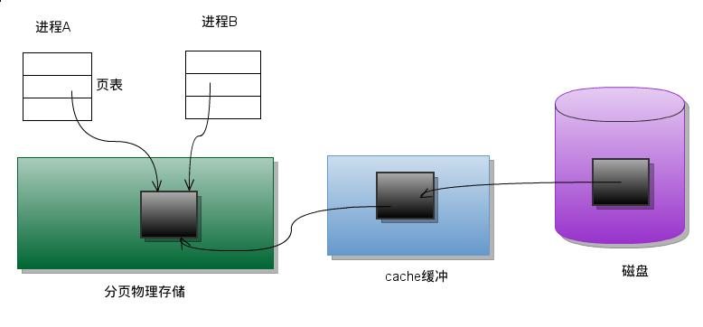
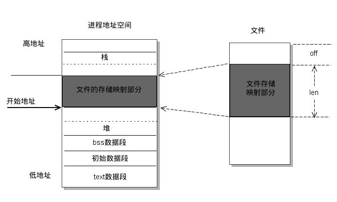

Linux/Unix系统知识
=========================

软件系统架构
-----------------

.. image:: ../_static/programStack.png

Linux/Unix进程内存空间的分配和管理
-----------------------------------

进程空间地址分配
^^^^^^^^^^^^^^^^^^^^^

.. image:: ../_static/memory_for_process.png

举例说明
^^^^^^^^^^^^

.. code-block:: c++

	int a = 0; //全局初始化区
	char *p1; //全局未初始化区
	void main()
	{
	    int b; //栈
	    char s[] = "abc"; //栈
	    char *p2; //栈
	    char *p3 = "123456"; //123456{post.content}在常量区，p3在栈上
	    static int c = 0; //全局（静态）初始化区
	    p1 = (char *)malloc(10); //分配得来得10字节的区域在堆区
	    p2 = (char *)malloc(20); //分配得来得20字节的区域在堆区
	    strcpy(p1, "123456");
	    //123456{post.content}放在常量区，编译器可能会将它与p3所指向的"123456"优化成一块
	}

堆和栈的区别
^^^^^^^^^^^^^^^^

* 管理方式不同

	堆的由程序员来动态的申请和释放，栈由编译器来自动管理，无需程序员干预

* 空间大小不同

	一般来讲在32位系统下，堆内存可以达到4G的空间。栈往往比较小。

* 堆的申请和释放会产生碎片，栈不会产生碎片。

* 生长方式不同，堆的向着内存地址增加的方向，栈向着内存地址减少的方式。

* 分配方式不同，堆是动态分配的。栈有静态和动态两种分配方式，静态分配由编译器完成，动态分配有alloca函数进行分配，释放由编译器进行释放，无需手工干预，但是这种方式不推荐。

* 分配效率不同

MMAP及共享内存
--------------------

什么是MMAP？
^^^^^^^^^^^^^^^

MMAP使得进程之间通过映射同一个普通文件实现共享内存。普通文件被映射进进程地址空间后，进程可以像访问普通内存一样对文件进行访问，不必调用read/write等操作。

共享内存有点
^^^^^^^^^^^^^^^^

最有用的进程间通讯方式，也是最快的IPC方式，因为进程可以直接读写内存，而不需要任何数据拷贝。管道和消息队列需要在内核和用户空间拷贝四次数据，共享内存只需要两次。

传统文件访问
^^^^^^^^^^^^^^^^^^

UNIX访问文件的传统方法是用open打开它们, 如果有多个进程访问同一个文件,则每一个进程在自己的地址空间都包含有该文件的副本,这不必要地浪费了存储空间.

.. image:: ../_static/traditional_file_operation.png

共享存储映射
^^^^^^^^^^^^^^^^^

进程A和进程B都将该页映射到自己的地址空间, 当进程A第一次访问该页中的数据时, 它生成一个缺页中断. 内核此时读入这一页到内存并更新页表使之指向它.以后, 当进程B访问同一页面而出现缺页中断时, 该页已经在内存, 内核只需要将进程B的页表登记项指向次页即可.

引入MMAP后的进程空间分布
^^^^^^^^^^^^^^^^^^^^^^^^^^^

`Linux的任督二脉：进程调度和内存管理`_
-----------------------------------------

.. _Linux的任督二脉：进程调度和内存管理: https://blog.csdn.net/21cnbao/article/details/77505330

